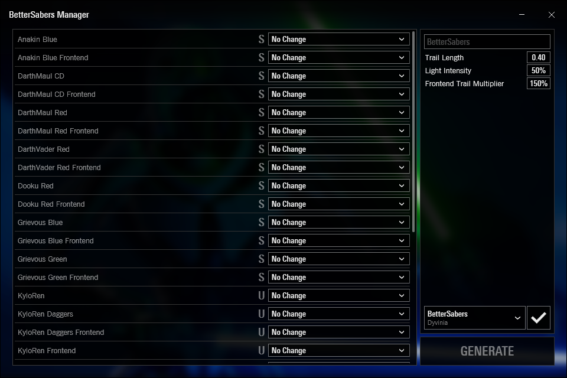

# Preset Packs

The presets automatically selected by the checkbox button can be changed with preset packs.

{ width="400"}

`NAME.pack.json` files control the auto selection of presets, aswell as the default name used in the generated mod.  
Users and creators can create new files using the `.pack.json` file extension to add new auto select packs to the dropdown below the `Auto Select Presets` button.

`Presets\BetterSabers\BetterSabers.pack.json` is the default **BetterSabers** preset pack:

``` json title="Presets\BetterSabers\BetterSabers.pack.json"
{
  // Metadata (1)
  "Metadata": {
    "Name": "BetterSabers",
    "Author": "Dyvinia"
  },

  // Presets (2)
  "Presets": {
    "red": "Red [BetterSabers]",
    "cd": "Red [BetterSabers]",
    "kylo": "Red [BetterSabers]",

    "blue": "Blue [BetterSabers]",

    "greenyellow": "Lime [BetterSabers]",
    "lime": "Lime [BetterSabers]",

    "green": "Green [BetterSabers]",

    "pink": "Pink [BetterSabers]",

    "purple": "Purple [BetterSabers]",

    "yellow": "Yellow [BetterSabers]"
  }
}
```

1. Where you name your preset aswell as crediting yourself as the author.

2. Values on the left are checked against FX files' names; if found, the Preset on the right side gets auto selected.   

Values on the left are checked against FX files' names. If the value is found in the name, the Preset on the right side gets auto selected.

For example, if a saber blueprint contains the text[^1] `red`, `cd`, or `kylo` in its name, it will select the preset named `Red [BetterSabers]`.  

**Notes:**  
• The file is read from top to bottom, so a file containing `greenyellow` will auto select Lime since it is above Green, even though `green` would also be satisfied.

[^1]: Case Insensitive